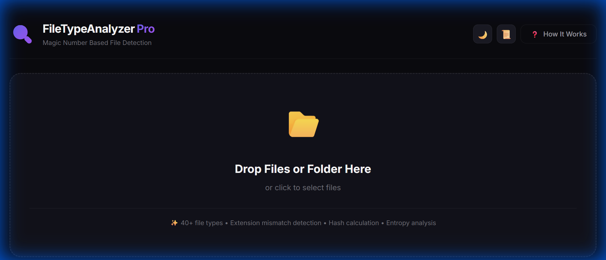

# FileTypeAnalyzer Pro 🔍⚡

[](https://yourusername.github.io/FileTypeAnalyzer)
[](https://developer.mozilla.org/en-US/docs/Web/JavaScript)
[](LICENSE)

A **high-performance, web-based file analysis tool** that identifies files by their **magic numbers** (binary signatures), not just extensions. This is the same technique used by antivirus software, digital forensics, and cybersecurity tools.



---

## 🚀 Try It Now

**[Open FileTypeAnalyzer Pro →](https://yourusername.github.io/FileTypeAnalyzer)**

Or run locally: Just open `index.html` in your browser!

---

## ⚡ Performance Highlights

| Feature | Specification |
|---------|---------------|
| **Analysis Speed** | 128 concurrent threads (Ultrasonic Mode) |
| **Organization Speed** | 64 concurrent file writes |
| **UI Smoothness** | 60 FPS locked (RAF-throttled) |
| **File Types** | 40+ signatures supported |

---

## 🎯 What Does It Do?

| Problem | Solution |
|---------|----------|
| A file named `photo.jpg` might actually be malware | Detects the **true file type** from binary signature |
| Can't tell if a file is encrypted | Calculates **entropy** to detect encrypted/compressed files |
| Need to verify file integrity | Generates **SHA-256 hash** fingerprint |
| Extension was changed to bypass filters | Flags **extension mismatches** |

---

## ✨ Features

### 🔍 Core Analysis
- **40+ File Types** - Images, documents, archives, audio, video, executables
- **Magic Number Detection** - Reads actual binary signatures
- **SHA-256 Hashing** - Cryptographic fingerprint for every file
- **Entropy Analysis** - Detect encrypted/compressed content

### 🛡️ Security Features
- **Extension Mismatch Detection** - Find disguised files
- **VirusTotal Integration** - One-click hash lookup
- **Hex Viewer** - Inspect raw file bytes
- **String Extraction** - Forensic analysis support

### ⚡ Performance Engine
- **Dynamic Concurrency** - Auto-adjusts based on file size
- **128-Thread Analysis** - Maximum CPU utilization for small files
- **64-Thread Organization** - Parallel file writing
- **60 FPS HUD** - Smooth real-time statistics display
- **Live ETA Timer** - Accurate remaining time estimation

### 📊 Visualization & Export
- **Pie & Bar Charts** - Visual file distribution
- **Dark/Light Theme** - Toggle with one click
- **JSON Export** - Download complete analysis reports
- **Scan History** - Track previous analyses

### 📁 File Organization
- **Organize by Type** - Automatically sort files into folders
- **Smart Naming** - Handles duplicates automatically
- **Race Condition Safe** - Pre-calculated filenames prevent conflicts

---

## 🎓 How It Works

Every file has a **magic number** - a unique signature at the start:

```
PNG  → 89 50 4E 47 (‰PNG)
PDF  → 25 50 44 46 (%PDF)
ZIP  → 50 4B 03 04 (PK..)
EXE  → 4D 5A       (MZ)
```

This tool reads these bytes to identify files, **regardless of extension**.

---

## 📁 Project Structure

```
FileTypeAnalyzer/
├── index.html     ← Open this to run!
├── style.css      ← Styling (dark/light themes)
├── app.js         ← Core logic (40+ signatures, performance engine)
├── worker.js      ← Web Worker for background processing
├── README.md
├── LICENSE
├── .gitignore
├── screenshots/   ← UI screenshots
├── src/           ← C++ reference implementation
└── tests/         ← Unit tests
```

---

## 🖥️ System Requirements

- **Browser**: Chrome 86+ / Edge 86+ / Firefox 90+ (File System Access API)
- **RAM**: 4GB minimum, 8GB+ recommended for large batches
- **No installation required** - runs entirely in browser

---

## 🌐 Deploy to GitHub Pages (Free)

1. Push this repo to GitHub
2. Go to **Settings → Pages**
3. Select **Source: main branch**
4. Your app is live at `https://yourusername.github.io/RepoName`

---

## 🔧 Technical Details

### Performance Tuning
```javascript
// Dynamic concurrency based on file size
if (avgSize < 1MB)  concurrency = 128;  // Small files: Ultrasonic
if (avgSize > 50MB) concurrency = 4;    // Large files: Safety mode
else                concurrency = 32;   // Balanced mode
```

### API Used
- **File System Access API** - Direct folder access
- **Web Crypto API** - SHA-256 hashing
- **Web Workers** - Background processing
- **RequestAnimationFrame** - 60 FPS UI updates

---

## 👤 Author

**Bhuvan** - 2nd Year, Information Science Engineering

---

## 📄 License

This project is licensed under the MIT License - see the [LICENSE](LICENSE) file for details.

---

⭐ **Star this repo if you found it useful!**
